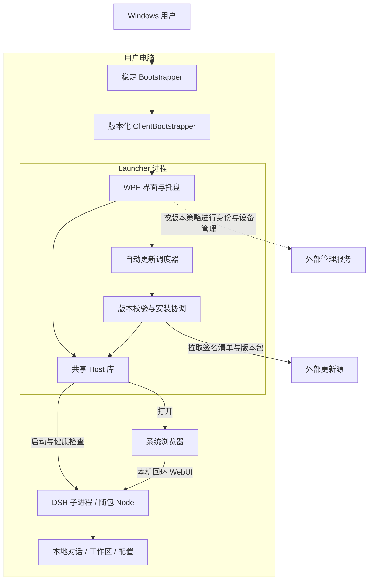
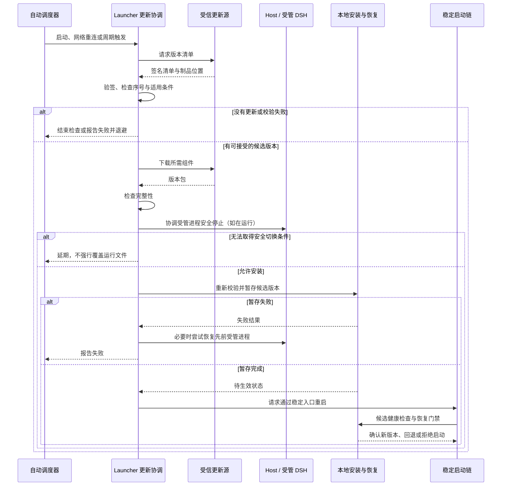

# Ensou DSH Launcher

**把本地 AI Agent 的安装、运行与更新，组织成普通用户能够理解的桌面体验。**

一个由 **ensou** 发起、以 **Ensou Studio** 名义维护的 Windows 桌面工程项目。围绕 [DeepSeek Harness](https://github.com/deepseek-ai/deepseek-harness)，探索从源码构建、运行环境封装，到后台进程管理、受控更新与失败恢复的完整交付链路。

`C# / .NET 10` · `WPF` · `Windows x64` · `Local-first` · `Source-available`

> **项目展示 / 非商业学习用途。** 这是第三方工程项目，不是 DeepSeek 官方客户端，也不代表官方背书。源码、测试和实验性分支不等于已经通过生产验收的安装包。

[架构与 UML](#架构概览) · [自动更新时序](#自动更新如何工作uml-时序图) · [源码导览](#从哪里开始阅读) · [详细架构文档](docs/architecture.md) · [许可证](LICENSE.md)

## 为什么做这个项目

项目起点是一个实际问题：开发者可以通过命令行部署 Agent，但普通用户往往被依赖安装、后台窗口、版本差异和更新故障挡在门外。

- **对使用者：** 希望像使用桌面应用一样启动服务、打开 WebUI、查看状态，不必学习 Git、FNM 或包管理器。
- **对维护者：** 希望 Launcher 与 DSH 能独立演进，同一份已验证的版本包可以交付给多台设备。
- **对本地数据：** 更换程序版本不应等于删除对话、工作区或用户配置。

因此，本项目的重点不是重新实现 Agent，而是研究 **Agent 周边的桌面运行与软件交付基础设施**。

## 核心设计与取舍

| 要解决的问题 | 架构选择 | 取舍与边界 |
| --- | --- | --- |
| 上游迭代频繁，用户不熟悉命令行 | 构建侧固定源码与依赖，客户端接收版本包 | 跟进上游需要兼容性验证，不是直接替用户执行 `git pull` |
| Launcher 更新时不能覆盖自己正在运行的文件 | 稳定启动入口 + 版本化客户端 + 当前/前一版本指针 | 增加启动链复杂度，换取明确的版本切换与恢复入口 |
| 后台窗口、进程残留与误关其他服务 | 共享 Host 库，管理自身启动的进程与 Windows Job Object | Host 不是系统级 Windows Service，不接管任意 DSH 进程 |
| 自动更新既要及时，又不能破坏运行中的任务 | 启动/重连/周期检查，下载后经过停机协调与写入门禁 | 联网不等于立即强杀；忙碌、验证失败或恢复条件不足时延期/拒绝 |
| 程序升级可能影响本地历史 | 运行文件与用户数据分离，显式处理数据兼容性和恢复 | 程序回退不自动等于数据格式回退 |
| 个人与组织用户需求不同 | 共享进程托管、基础合同和调度，分别组合身份与发布策略 | 当前不是单一 UI 加一个开关；企业端仍有独立实现 |

本仓库可以用来研究这些机制的代码与测试，但不能把设计目标直接视为生产保证。它是一份脱敏源码快照，不包含原始提交历史、开发分支、PR 讨论、Actions 日志或本机未提交文件。

## 架构概览

下图展示受管客户端的主要组件与进程边界。**图中的 Host、调度器和更新协调由 Launcher 进程组合；DSH 是独立子进程。** Bootstrapper 也会调用安装状态与恢复库完成启动门禁。这里是组件关系图，后面的时序图、详细文档中的类图与状态图使用 UML 风格表达。

运行版本通过版本目录与指针切换，用户数据目录不是普通发布包的组成部分。图中的外部更新源与管理服务是系统边界，**不表示本仓库提供可用的线上服务**；企业服务端源码继续保持私有。

### Personal 与 Enterprise 如何复用

两者都以 Ensou Studio 名义提供 Windows 本地 Launcher，复用 `Contracts` 中的基础协议与自动调度，以及 `Host` 中的进程托管、健康检查和本地 WebUI 边界。Personal 使用 `UpdateEngine` 与个人身份客户端；Enterprise 组合企业客户端、安装库与独立的发布合同。

这是一种“共享底层机制、分别组织产品策略”的结构，并不代表两套更新逻辑已经完全合并。具体依赖与需要进一步收敛的部分见 [架构文档](docs/architecture.md#个人版与企业版的代码边界)。

### 网络与身份边界

最新设计选择是：**模型请求和浏览流量走使用者本机网络；Ensou 管理服务负责身份、设备及软件交付，而不是推理代理。** 本地存储不代表模型请求不离开电脑：选定的模型提供方仍会收到请求内容。

这项选择记录在 [ADR 0010](docs/adr/0010-local-direct-model-and-browser-network.md)。快照同时保留较早的企业代理实现和隔离的直连适配工作，不能把目标拓扑当作所有构建配置的现状；也不能把企业微信审批、后台 Key 分配或真实客户部署描述为已完成验收。

## 自动更新如何工作：UML 时序图

以 Personal v2 更新链路为例，下面省略字段级校验，展示主要职责与失败边界。企业版使用独立发布合同和授权门禁，不能直接套用同一套内部调用。

**自动化不等于绕过校验。** 调度器负责触发和退避，更新链路负责可信来源、下载、授权、写入协调及恢复。当前默认检查周期为 5 分钟，并监听网络恢复；它不是服务器向客户端开放端口后远程执行命令的机制。

Launcher 与 DSH 的版本身份分开管理，允许只推进其中一个组件；发布集合仍需要确认两者及本地数据的兼容关系。源码中的具体职责见 [自动更新实现映射](docs/architecture.md#自动更新与失败恢复)。

## 当前状态与上游关系

截至 **2026-09-15**，项目开发保持暂停，现有成果保留用于展示、学习和后续评估；这不是已经完成的生产发行，也没有在此承诺正式安装包或维护时限。

DeepSeek 官方仓库已经加入 [Desktop 实现](https://github.com/deepseek-ai/deepseek-harness/tree/master/apps/desktop)。本项目正在重新评估独立桌面壳的必要性，优先考虑复用官方桌面能力，并把真正有差异的管理与部署支持单独保留。这不代表已经完成迁移，也不代表官方桌面安装包或更新流程已经由本项目验收。

设计文档保留了不同阶段的网络、身份和发布方案，仅供学习，不应直接作为当前部署指南。设备标识、个人路径与客户称谓已替换为示例；自动发布工作流未包含在公开副本中。脱敏后的内容与原始签名、哈希和验收记录不能互相替代，需要重新构建、校验与独立验收，不能据此操作真实设备或发布通道。

## 从哪里开始阅读

| 路径 | 内容 |
| --- | --- |
| [`src/Ensou.Dsh.Launcher/`](src/Ensou.Dsh.Launcher/) | Personal WPF 入口、托盘与更新协调 |
| [`src/Ensou.Dsh.Enterprise.Launcher/`](src/Ensou.Dsh.Enterprise.Launcher/) | Enterprise WPF 入口与管理能力组合 |
| [`src/Ensou.Dsh.Host/`](src/Ensou.Dsh.Host/) | 共享进程托管、运行租约、健康检查与 WebUI |
| [`src/Ensou.Dsh.Contracts/`](src/Ensou.Dsh.Contracts/) | 基础合同、运行协调协议、自动更新调度 |
| [`src/Ensou.Dsh.UpdateEngine/`](src/Ensou.Dsh.UpdateEngine/) | Personal 制品获取、安装、状态与数据恢复 |
| [`src/Ensou.Dsh.Enterprise.Installation/`](src/Ensou.Dsh.Enterprise.Installation/) | Enterprise 安装、版本指针与恢复实现 |
| [`tests/`](tests/) | .NET 测试程序与隔离夹具；有测试不等于本快照已全量验证 |
| [`docs/architecture.md`](docs/architecture.md) | 组件说明、UML 类图与更新状态模型 |
| [`docs/adr/`](docs/adr/) | 架构决策与取舍 |
| [`release/`](release/) | 清单、版本与制品设计 |
| [`installer/`](installer/) | 安装布局及数据保留边界 |
| [`security/`](security/) | 威胁模型与信任设计 |
| [`versions/locked.json`](versions/locked.json) | 所在分支锁定的上游版本 |

**五分钟阅读路线：** 先看本页组件图，再读 [Host 的核心类](src/Ensou.Dsh.Host/DshHostService.cs) 和 [自动调度器](src/Ensou.Dsh.Contracts/AutomaticUpdateScheduler.cs)，最后沿 [Personal 更新协调](src/Ensou.Dsh.Launcher/MainWindow.AutomaticUpdates.cs) 查看“发现 → 下载 → 安装 → 重启”的衔接。

本仓库不是面向普通用户的一键安装入口。研究构建时，先检查 [global.json](global.json)（当前固定 SDK `10.0.302`）、项目文件及构建脚本。构建机的工具链与用户安装包的运行依赖是两回事；桌面项目有明确的发布配置和信任输入要求，不应省略门禁来获得所谓“正式包”。请使用隔离测试环境，不要把示例域名、身份或测试密钥用于真实部署。

欢迎通过 Issue 或 PR 讨论架构、文档与可复现的问题。请注明所依据的源码版本、预期行为和观察结果，不要上传真实用户配置、设备凭据或对话数据。公开副本不包含自动发布工作流。

## 许可证与非商业使用

本项目中由 ensou / Ensou Studio 有权授权的原创代码与文档采用 **[PolyForm Noncommercial License 1.0.0](LICENSE.md)**。允许的非商业目的、修改、分发和声明保留要求以许可证原文为准。

- 欢迎在许可证允许的范围内阅读、学习、实验、修改和分享。
- 商业用途不由此许可证授权；需要另行取得权利人的书面许可。申请入口为本仓库的 Issue 或 Pull Request，申请本身不构成授权，请勿提交客户信息或秘密。
- 这是 **source-available（源码可见）** 项目，不标榜为允许任意商用的 OSI 标准开源项目。
- DeepSeek Harness、第三方依赖及其既有代码继续适用各自的许可证；本项目不撤销上游 MIT 等许可已经授予的权利。详见 [NOTICE.md](NOTICE.md)。

许可证约束使用与分发权利，不是技术防拷贝机制，也不是 Windows 代码签名证书。

## 反馈与安全

欢迎通过 Issue 讨论工程设计与学习问题。安全问题请遵循 [SECURITY.md](SECURITY.md)，不要公开上传 API Key、签名材料、员工信息、对话或工作区数据。

**作者：ensou · 项目品牌：Ensou Studio**

---

### English summary

Ensou DSH Launcher is an independent Ensou Studio project exploring Windows desktop delivery for local DeepSeek Harness agents: a WPF launcher, owned background processes, managed runtime packages, signed update manifests, and recovery boundaries. It is shared as an engineering portfolio and for noncommercial study, not as an official DeepSeek product or a production-certified distribution. Development is paused while the upstream Desktop implementation is evaluated. The enterprise server remains private. Original licensable contributions are offered under PolyForm Noncommercial 1.0.0; third-party licenses remain unchanged.
