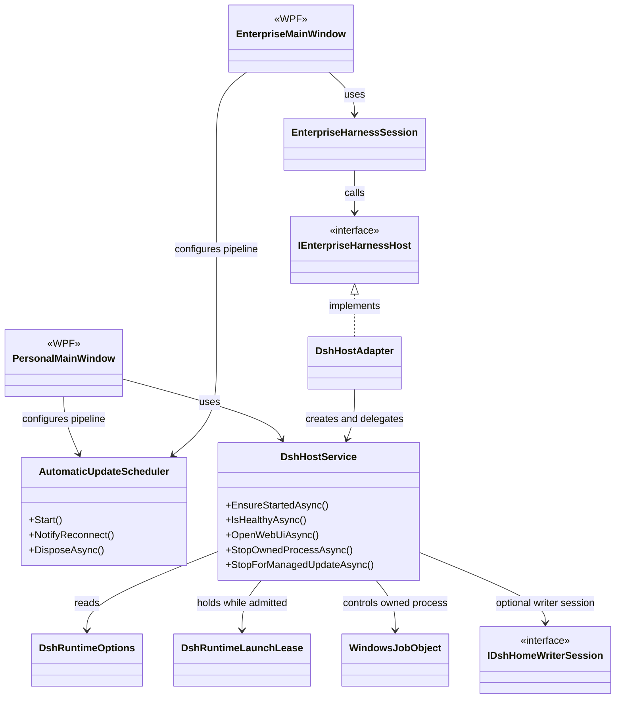
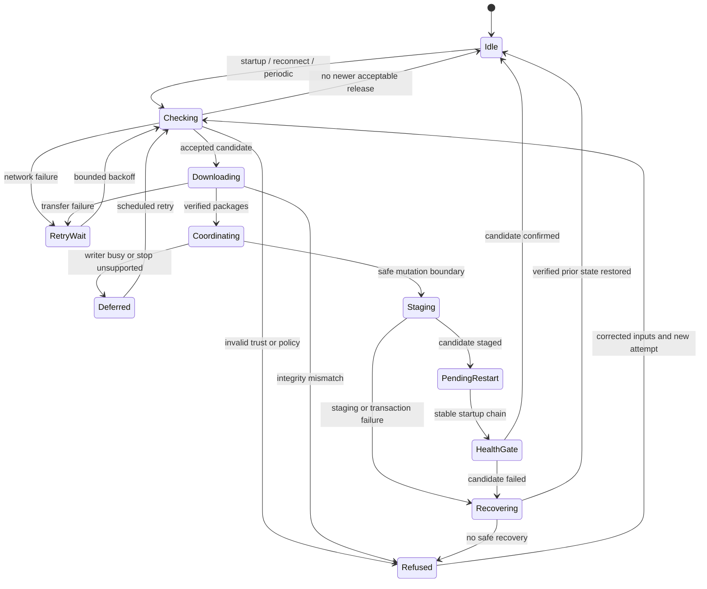

# Ensou DSH Launcher：架构逻辑与 UML

[返回项目首页](../README.md)

本文描述公开源码快照中的客户端结构，并解释它背后的设计取舍。作者与项目品牌为 **ensou / Ensou Studio**。它是工程作品说明，不是部署验收报告，也不包含私有企业服务端的内部设计。

## 阅读约定

- **源码结构：** 可以在文中链接的类、项目引用或合同中找到对应实现。
- **逻辑模型：** 为便于理解而归纳的步骤与状态，不声称代码中存在同名枚举或每条路径完全相同。
- **产品目标：** 已记录的设计方向，不能视为已发布、已验收的能力。

图采用 Mermaid 文本语法维护；GitHub 支持在 Markdown 中直接显示，详见 [GitHub 图表文档](https://docs.github.com/en/get-started/writing-on-github/working-with-advanced-formatting/creating-diagrams)。修改源码职责时，应同时复核图中的箭头和文字。

## 一、为什么拆成这些组件

### 稳定启动入口与可替换的客户端

启动快捷方式不应绑定某个易被替换的 Launcher 版本目录。受管启动链分为：

1. **Bootstrapper / Startup Stub：** 稳定入口，读取受管状态，并参与候选版本健康检查与恢复。
2. **ClientBootstrapper：** 位于版本目录内，按该版本的合同继续启动和验证桌面客户端。
3. **Launcher：** WPF 界面与托盘，组合身份、版本检查、进程托管及状态展示。

这是“启动入口的稳定性”与“产品代码的可升级性”之间的分层，不代表所有组件始终作为长驻进程同时运行。实现入口分别见 [Personal Bootstrapper](../src/Ensou.Dsh.Bootstrapper/Program.cs)、[Personal ClientBootstrapper](../src/Ensou.Dsh.ClientBootstrapper/Program.cs) 及 [Enterprise Bootstrapper](../src/Ensou.Dsh.Enterprise.Bootstrapper/Program.cs)。

### Host 是进程内库，不是服务器

[`Ensou.Dsh.Host`](../src/Ensou.Dsh.Host/Ensou.Dsh.Host.csproj) 是被两个 Launcher 引用的共享库。它负责被本项目启动的 DSH 子进程、本机回环监听检查、WebUI 打开以及更新前的停机协调；没有独立的 Host 可执行入口，也不是需要另外安装的 Windows Service。

`DshHostService` 使用隐藏窗口的进程启动配置，并配合 Windows Job Object、运行租约和数据写入会话约束生命周期。其设计重点是：**知道自己启动了谁、可以停止谁，以及何时可以切换版本**，而不是按进程名结束机器上的所有 Node/DSH。

### 可替换的版本与需要保留的数据

运行版本、下载缓存、版本指针和恢复记录属于软件交付层；用户的对话、工作区和本地配置属于数据层。它们不能混装在同一份可随意覆盖的程序包中。

隔离目录只是第一步。运行中的写入者、旧版本能否读取新数据、候选版本是否真正健康，同样影响恢复决策。因此源码包含数据写入协调与恢复事务，而不是只改一个 `current` 路径。示例实现见 [PersonalHarnessHomeCoordinator](../src/Ensou.Dsh.UpdateEngine/PersonalHarnessHomeCoordinator.cs) 和 [PersonalHarnessHomeTransaction](../src/Ensou.Dsh.UpdateEngine/PersonalHarnessHomeTransaction.cs)。

## 二、UML 类图：共享进程托管

下图截取真实类的关键关系，省略参数、返回类型、其他成员及异常分支。`MainWindow` 的两个别名分别指向不同命名空间中的窗口类；实线箭头表示使用关系，虚线三角箭头表示接口实现。

对应源码：

- 窗口：[`Ensou.Dsh.Launcher.MainWindow`](../src/Ensou.Dsh.Launcher/MainWindow.xaml.cs)、[`Ensou.Dsh.Enterprise.Launcher.MainWindow`](../src/Ensou.Dsh.Enterprise.Launcher/MainWindow.xaml.cs)。
- 企业适配层：[`EnterpriseHarnessSession`](../src/Ensou.Dsh.Enterprise.Client/EnterpriseHarnessSession.cs)、[`DshHostAdapter`](../src/Ensou.Dsh.Enterprise.Launcher/DshHostAdapter.cs)。
- 共享 Host：[`DshHostService`](../src/Ensou.Dsh.Host/DshHostService.cs)、[`DshRuntimeLaunchLease`](../src/Ensou.Dsh.Host/DshRuntimeLaunchLease.cs)、[`WindowsJobObject`](../src/Ensou.Dsh.Host/WindowsJobObject.cs)。
- 共享合同：[`IDshHomeWriterSession`](../src/Ensou.Dsh.Contracts/IDshHomeWriterSession.cs)、[`AutomaticUpdateScheduler`](../src/Ensou.Dsh.Contracts/AutomaticUpdateScheduler.cs)。

## 个人版与企业版的代码边界

这里区分“可复用的机制”和“不同产品的策略”，避免误以为两个版本只是替换名称与 Logo。

| 层次 | Personal | Enterprise | 实际复用边界 |
| --- | --- | --- | --- |
| 桌面入口 | `Ensou.Dsh.Launcher` | `Ensou.Dsh.Enterprise.Launcher` | 独立 WPF 项目，不是同一个窗口的皮肤 |
| 进程托管 | `Ensou.Dsh.Host` | `Ensou.Dsh.Host` | 共享 Host，由调用方提供相应配置与门禁 |
| 基础合同与调度 | `Ensou.Dsh.Contracts` | `Ensou.Dsh.Contracts` | 共享协议类型与调度器；调度器不代替授权和验签 |
| 安装与恢复 | `Ensou.Dsh.UpdateEngine` | `Ensou.Dsh.Enterprise.Installation` | 各自实现版本状态、安装和恢复链路 |
| 身份客户端 | `Personal.Windows` / `Personal.Client` | `Enterprise.Client` / `Enterprise.Contracts` | 产品策略不同；公开接口不提供真实服务或凭据 |
| 发布工具 | `Personal.ReleasePublisher` / `Personal.FeedPromoter` | `Enterprise.ReleasePublisher` / `Enterprise.FeedPromoter` | 面向发布侧，不是每台用户电脑上长驻的服务 |

这不是“全量代码复用已经完成”的陈述。进一步抽取重复安装/恢复逻辑有维护价值，但应先保留不同信任合同和兼容性验证，不能为了合并代码而弱化边界。

项目引用可从 [Personal Launcher 项目](../src/Ensou.Dsh.Launcher/Ensou.Dsh.Launcher.csproj)、[Enterprise Launcher 项目](../src/Ensou.Dsh.Enterprise.Launcher/Ensou.Dsh.Enterprise.Launcher.csproj) 和 [解决方案](../Ensou.Dsh.slnx) 交叉检查。

## 自动更新与失败恢复

### 触发与执行分离

`AutomaticUpdateScheduler` 位于 `Contracts`，而不是 `UpdateEngine`。两个窗口各自注入更新执行流程：

- 启动触发、网络恢复通知、默认 5 分钟周期触发；
- 合并重复信号，避免并行重复跑更新；
- 忙碌时默认 15 秒后重试，失败退避从 15 秒开始、上限 5 分钟；
- 生命周期依附运行中的客户端，不是电脑关机后仍然能执行的远程推送服务。

具体执行见 [Personal 自动更新](../src/Ensou.Dsh.Launcher/MainWindow.AutomaticUpdates.cs) 和 [Enterprise 自动更新](../src/Ensou.Dsh.Enterprise.Launcher/MainWindow.AutomaticUpdates.cs)。企业流程还有身份、设备和授权生命周期门禁。

### UML 状态图：更新的逻辑模型

这是对主流程的归纳，**不是源码中的单一状态枚举**。它强调“失败发生在什么阶段”，并区分安全延期与真正失败。

图中 `Refused` 表示拒绝**本次不安全操作**，不代表所有拒绝都必须关闭原有 Launcher 或停止一个仍然有效的运行版本。是否允许继续运行，要由对应的信任、授权与恢复策略决定；“点重试”本身不会绕过这些门禁。

### 实现映射

| 职责 | 源码入口 |
| --- | --- |
| Personal 清单检查、下载与暂存入口 | [`PersonalUpdateCoordinatorV2`](../src/Ensou.Dsh.Launcher/PersonalUpdateCoordinatorV2.cs) |
| 协调受管 Runtime 停止；暂存未完成时尝试恢复原进程 | [`PersonalManagedRuntimeUpdateCoordinator`](../src/Ensou.Dsh.Launcher/PersonalManagedRuntimeUpdateCoordinator.cs) |
| 制品获取与安装 | [`PersonalReleaseArtifactAcquisition`](../src/Ensou.Dsh.UpdateEngine/PersonalReleaseArtifactAcquisition.cs)、[`PersonalReleaseArtifactInstaller`](../src/Ensou.Dsh.UpdateEngine/PersonalReleaseArtifactInstaller.cs) |
| 本地数据写入与事务 | [`PersonalHarnessHomeCoordinator`](../src/Ensou.Dsh.UpdateEngine/PersonalHarnessHomeCoordinator.cs)、[`PersonalHarnessHomeTransaction`](../src/Ensou.Dsh.UpdateEngine/PersonalHarnessHomeTransaction.cs) |
| 重启协调 | [`LauncherRestartCoordinator`](../src/Ensou.Dsh.Host/LauncherRestartCoordinator.cs)、[`Bootstrapper`](../src/Ensou.Dsh.Bootstrapper/Program.cs) |
| Enterprise 专属安装与发布合同 | [`Enterprise.Installation`](../src/Ensou.Dsh.Enterprise.Installation/)、[`Enterprise.ReleaseContracts`](../src/Ensou.Dsh.Enterprise.ReleaseContracts/) |

不应承诺“任何升级失败都必然自动回退”。此前版本、数据兼容性、目录完整性或授权状态不足时，拒绝启动并保留诊断信息，比带着未知状态继续运行更符合这里的设计。

## 三、模型、管理与更新不是同一条网络通道

最新产品目标见 [ADR 0010](adr/0010-local-direct-model-and-browser-network.md)：

| 通道 | 目标职责 | 不应混淆的概念 |
| --- | --- | --- |
| DSH → 模型提供方 / 浏览目标 | 本机网络发起模型或工具请求 | “本地部署”不是离线推理，也不是数据永不离开电脑 |
| Launcher → 管理服务 | 身份、设备、批准与管理策略 | 管理会话凭据不是模型 API Key |
| Launcher → 更新源 | 拉取签名清单与版本制品 | 更新签名不是用户登录，也不是 Windows 信任证书本身 |
| 本机浏览器 → 本机 DSH | 打开受控的回环 WebUI | WebUI 访问凭据不是模型 API Key |

上述第一行是最新目标，不是对快照中每个企业构建模式的统一保证。较早的代理路线、独立的直连补丁与发布准入代码仍同时存在，正式选择某个组合前必须做对应验证。企业服务端未公开；文档不披露实际主机、客户配置或凭据。

## 四、如何理解本作品的验证范围

源码包含针对协议、版本恢复、路径边界、运行租约、自动调度和安装的测试程序。阅读时可从 [自动调度测试](../tests/Ensou.Dsh.AutomaticUpdateSchedulerTests/)、[Personal 更新测试](../tests/Ensou.Dsh.Personal.UpdateTests/) 与 [Enterprise 更新测试](../tests/Ensou.Dsh.Enterprise.UpdateTests/) 入手。

这些测试展示了工程验证的方法，不能替代本脱敏快照的独立构建与运行验收：

- 脱敏更改后的字节不再等于原始制品，不能复用原始哈希、签名或设备验收结论。
- 本次公开不提供签名安装包、真实更新通道、企业管理账号或自动发布工作流。
- 尚未证明本快照在全新 Windows 设备上的完整安装与远程更新链路；本次文档修改也没有运行产品构建或部署。
- 上游版本、信任配置和数据兼容性变化后，需要重新验证，而不是只改版本号。

公开这份工程作品的目的，是让读者看清问题、结构和取舍，并能沿源码继续研究。许可证与第三方边界以 [LICENSE.md](../LICENSE.md) 和 [NOTICE.md](../NOTICE.md) 为准。
